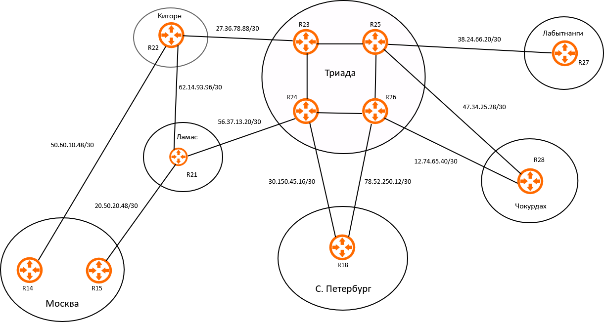
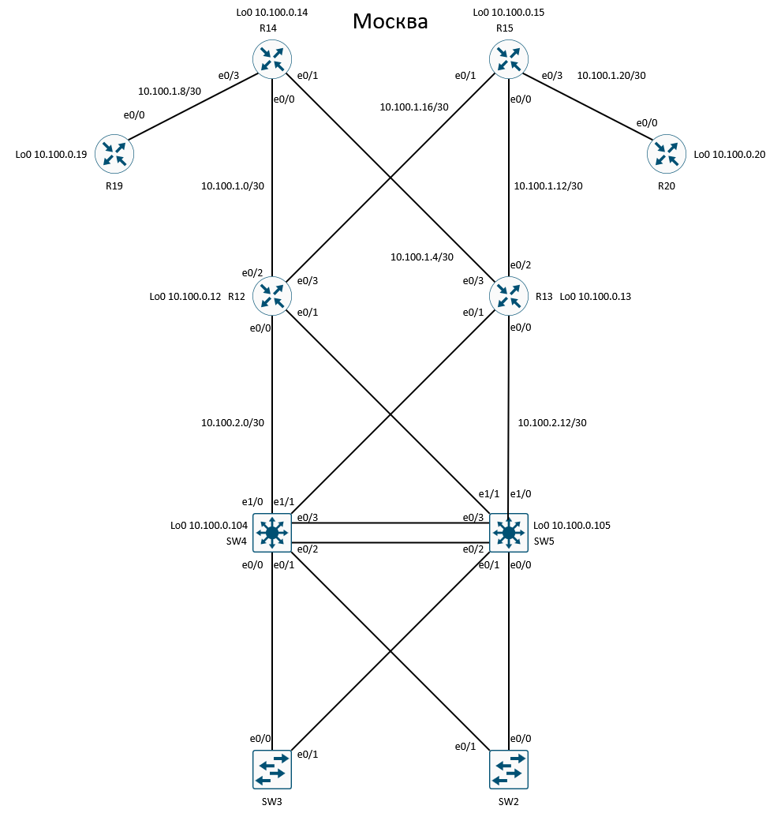
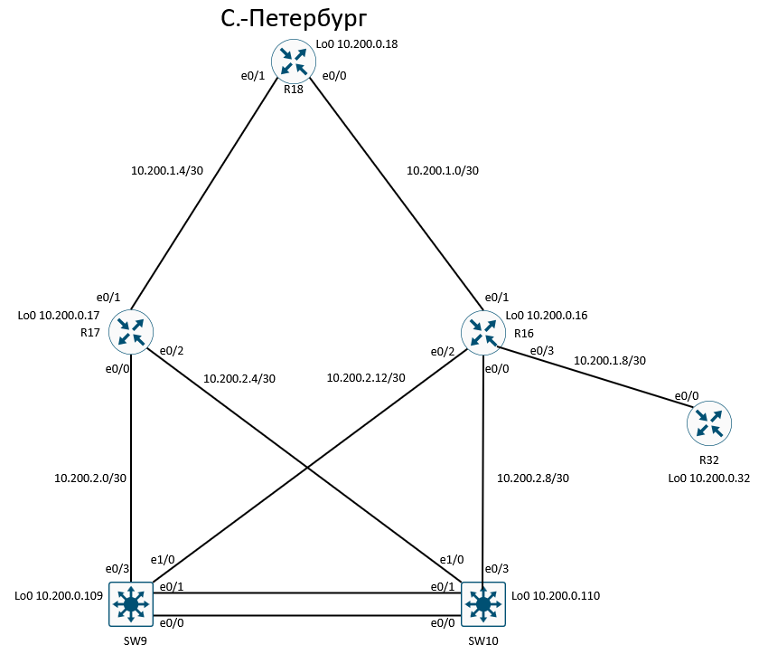

# Лабораторная работа #1: Проектирование сети

## План работ:
1. Разработать и задокументировать адресное пространство для лабораторного стенда;
2. Настроить ip-адреса на каждом активном порту;
3. Настроить каждый VPC в каждом офисе в своем VLAN;
4. Настроить VLAN/Loopbackup interface управления для сетевых устройств;
5. Настроить сети офисов так, чтобы не возникало broadcast штормов, а использование линков было максимально оптимизировано;
6. Использовать IPv4. IPv6 по желанию.

### Адресация
Выделены следующие диапазоны сетей:
* AS 1001 (Москва): 10.100.0.0/16
* AS 2042 (С.-Петербург): 10.200.0.0/16
* AS 520 (Триада): 172.31.100.0/24
* AS 101 (Киторн): 172.31.150.0/24
* AS 301 (Ламас): 172.31.200.0/24
* Лабытнанги: 192.168.100.0/24
* Чокурдах: 192.168.200.0/22

 #### Таблицы и схемы сетей

 #### Общая схема

 ### AS1001 (Москва)

| Устройство | Интерфейс | IP Адрес     | Маска | Описание        |
| ---------- | --------- | ------------ | ----- | --------------- |
| **R14**    | Lo0       | 10.100.0.14  | /32   | Loopback        |
| **R14**    | e0/0      | 10.100.1.1   | /30   | R12             |
| **R14**    | e0/1      | 10.100.1.5   | /30   | R13             |
| **R14**    | e0/2      | 50.60.10.50  | /30   | R22 (AS 101)    |
| **R14**    | e0/3      | 10.100.1.9   | /30   | R19             |
|            |           |              |       |                 |
| **R15**    | Lo0       | 10.100.0.15  | /32   | Loopback        |
| **R15**    | e0/0      | 10.100.1.13  | /30   | R13             |
| **R15**    | e0/1      | 10.100.1.17  | /30   | R12             |
| **R15**    | e0/2      | 20.50.20.50  | /30   | R21 (AS 301)    |
| **R15**    | e0/3      | 10.100.1.21  | /30   | R20             |
|            |           |              |       |                 |
| **R12**    | Lo0       | 10.100.0.12  | /32   | Loopback        |
| **R12**    | e0/0      | 10.100.2.1   | /30   | SW4             |
| **R12**    | e0/1      | 10.100.2.5   | /30   | SW5             |
| **R12**    | e0/2      | 10.100.1.2   | /30   | R14             |
| **R12**    | e0/3      | 10.100.1.18  | /30   | R15             |
|            |           |              |       |                 |
| **R13**    | Lo0       | 10.100.0.13  | /32   | Loopback        |
| **R13**    | e0/0      | 10.100.2.9   | /30   | SW4             |
| **R13**    | e0/1      | 10.100.2.13  | /30   | SW5             |
| **R13**    | e0/2      | 10.100.1.14  | /30   | R15             |
| **R13**    | e0/3      | 10.100.1.6   | /30   | R14             |
|            |           |              |       |                 |
| **R19**    | Lo0       | 10.100.0.19  | /32   | Loopback        |
| **R19**    | e0/0      | 10.100.1.10  | /30   | R14             |
|            |           |              |       |                 |
| **R20**    | Lo0       | 10.100.0.20  | /32   | Loopback        |
| **R20**    | e0/0      | 10.100.1.22  | /30   | R15             |
|            |           |              |       |                 |
| **SW4**    | Lo0       | 10.100.0.104 | /32   | Loopback        |
| **SW4**    | e1/0      | 10.100.2.2   | /30   | R12             |
| **SW4**    | e1/1      | 10.100.2.10  | /30   | R13             |
| **SW4**    | e0/2      |              |       | Po1->SW5        |
| **SW4**    | e0/3      |              |       | Po1->SW5        |
| **SW4**    | vlan 100  | 10.100.10.4  | /24   | vlan int.       |
| **SW4**    | vlan 200  | 10.100.20.4  | /24   | vlan int.       |
| **SW5**    | Lo0       | 10.100.0.105 | /32   | Loopback        |
| **SW5**    | e1/0      | 10.100.2.6   | /30   | R12             |
| **SW5**    | e1/1      | 10.100.2.13  | /30   | R13             |
| **SW5**    | e1/2      |              |       | Po1->SW4        |
| **SW5**    | e1/3      |              |       | Po1->SW4        |
| **SW5**    | vlan 100  | 10.100.10.5  | /24   | vlan int.       |
| **SW5**    | vlan 200  | 10.100.20.5  | /24   | vlan int.       |
|            |           |              |       |                 |
| **VPC1**   | eth0      | 10.100.10.99 | /24   | SW3->R12        |
| **VPC7**   | eth0      | 10.100.20.99 | /24   | SW2->R13        |

#### AS 2042 (С.-Петербург)

| Устройство | Интерфейс | IP Адрес     | Маска | Описание        |
| :--------- | :-------- | :----------- | :---- | :-------------- |
| **R18**    | Lo0       | 10.200.0.18  | /32   | Loopback |
| **R18**    | e0/0      | 10.200.1.1   | /30   | R16             |
| **R18**    | e0/1      | 10.200.1.5   | /30   | R17             |
| **R18**    | e0/2      | 30.150.45.18 | /30   | R24 (AS 520)    |
| **R18**    | e0/3      | 78.52.250.14 | /30   | R26 (AS 520)    |
|            |           |              |       |                 |
| **R17**    | Lo0       | 10.200.0.17  | /32   | Loopback        |
| **R17**    | e0/0      | 10.200.2.1   | /30   | SW9             |
| **R17**    | e0/1      | 10.200.1.6   | /30   | R18             |
| **R17**    | e0/2      | 10.200.2.5   | /30   | SW10            |
|            |           |              |       |                 |
| **R16**    | Lo0       | 10.200.0.16  | /32   | Loopback        |
| **R16**    | e0/0      | 10.200.2.9   | /30   | SW10            |
| **R16**    | e0/1      | 10.200.1.2   | /30   | R18             |
| **R16**    | e0/2      | 10.200.2.13  | /30   | SW9             |
| **R16**    | e0/3      | 10.200.1.9   | /30   | R32             |
|            |           |              |       |                 |
| **R32**    | Lo0       | 10.200.0.32  | /32   | Loopback        |
| **R32**    | e0/0      | 10.200.1.10  | /30   | R16             |
|            |           |              |       |                 |
| **SW9**    | Lo0       | 10.100.0.109 | /32   | Loopback        |
| **SW9**    | e0/0      |              |       | Po1->SW10       |
| **SW9**    | e0/1      |              |       | Po1->SW10       |
| **SW9**    | e0/3      | 10.200.2.2   | /30   | R17             |
| **SW9**    | e1/0      | 10.200.2.14  | /30   | R16             |
| **SW9**    | Vlan300   | 10.200.30.9  | /24   | vlan int.       |
| **SW9**    | Vlan400   | 10.200.40.9  | /24   | vlan int.       |
|            |           |              |       |                 |
| **SW10**   | Lo0       | 10.100.0.110 | /32   | Loopback        |
| **SW10**   | e0/0      |              |       | Po1->SW9        |
| **SW10**   | e0/1      |              |       | Po1->SW9        |
| **SW10**   | e0/3      | 10.200.2.10  | /30   | R16             |
| **SW10**   | e1/0      | 10.200.2.6   | /30   | R17             |
| **SW10**   | Vlan300   | 10.200.30.10 | /24   | vlan int.       |
| **SW10**   | Vlan400   | 10.200.40.10 | /24   | vlan int.       |
|            |           |              |       |                 |
| **VPC8**   | eth0      | 10.200.30.99 | /24   | SW9             |
| **VPC11**  | eth0      | 10.200.40.99 | /24   | SW10            |

#### AS 520 (Триада)

| Устройство | Интерфейс | IP Адрес      | Маска | Описание        |
| :--------- | :-------- | :-----------  | :---- | :-------------- |
| **R23**    | Lo0       | 172.31.100.23 | /32   | Loopback        |
| **R23**    | e0/0      | 27.36.78.90   | /30   | R22 (AS 101)    |
| **R23**    | e0/1      | 172.31.100.1  | /30   | R25             |
| **R23**    | e0/2      | 172.31.100.5  | /30   | R24             |
|            |           |               |       |                 |
| **R25**    | Lo0       | 172.31.100.25 | /32   | Loopback        |
| **R25**    | e0/0      | 172.31.100.2  | /30   | R23             |
| **R25**    | e0/1      | 38.24.66.21   | /30   | R27 (Лабытнанги)|
| **R25**    | e0/2      | 172.31.100.9  | /30   | R26             |
| **R25**    | e0/3      | 47.34.25.30   | /30   | R28 (Чокурдах)  |
|            |           |               |       |                 |
| **R24**    | Lo0       | 172.31.100.24 | /32   | Loopback        |
| **R24**    | e0/0      | 56.37.13.22   | /30   | R21 (AS 301)    |
| **R24**    | e0/1      | 172.31.100.13 | /30   | R26             |
| **R24**    | e0/2      | 172.31.100.6  | /30   | R23             |
| **R24**    | e0/3      | 30.150.45.17  | /30   | R18 (AS 2042)   |
|            |           |               |       |                 |
| **R26**    | Lo0       | 172.31.100.26 | /32   | Loopback        |
| **R26**    | e0/0      | 172.31.100.14 | /30   | R24             |
| **R26**    | e0/1      | 12.74.65.41   | /30   | R28 (Чокурдах)  |
| **R26**    | e0/2      | 172.31.100.10 | /30   | R25             |
| **R26**    | e0/3      | 78.52.250.13  | /30   | R18 (AS 2042)   |

#### AS 101 (Киторн)

| Устройство | Интерфейс | IP Адрес      | Маска | Описание        |
| :--------- | :-------- | :-----------  | :---- | :-------------- |
| **R22**    | Lo0       | 172.31.150.22 | /32   | Loopback        |
| **R22**    | e0/0      | 50.60.10.49   | /30   | R14 (AS 1001)   |
| **R22**    | e0/1      | 62.14.93.98   | /30   | R21 (AS 301)    |
| **R22**    | e0/2      | 27.36.78.89   | /30   | R23 (AS 520)    |

#### AS 301 (Ламас)

| Устройство | Интерфейс | IP Адрес      | Маска | Описание        |
| :--------- | :-------- | :-----------  | :---- | :-------------- |
| **R21**    | Lo0       | 172.31.150.21 | /32   | Loopback        |
| **R21**    | e0/0      | 20.50.20.49   | /30   | R15 (AS 1001)   |
| **R21**    | e0/1      | 62.14.93.97   | /30   | R22 (AS 101)    |
| **R21**    | e0/2      | 56.37.13.21   | /30   | R24 (AS 520)    |

#### Лабытнанги

| Устройство | Интерфейс | IP Адрес       | Маска | Описание        |
| ---------- | --------- | -------------- | ----- | --------------- |
| **R27**    | Lo0       | 192.168.100.27 | /32   | Loopback        |
| **R27**    | e0/0      | 38.24.66.22    | /30   | R25 (AS 520)    |

#### Чокурдах

| Устройство | Интерфейс | IP Адрес        | Маска | Описание      |
| ---------- | --------- | -------------   | ----- | ------------- |
| **R28**    | Lo0       | 192.168.200.28  | /32   | Loopback int. |
| **R28**    | e0/0      | 12.74.65.42     | /30   | R26 (AS 520)  |
| **R28**    | e0/1      | 47.34.25.29     | /30   | R25 (AS 520)  |
| **R28**    | e0/2      | 192.168.200.1   | /30   | SW29          |
|            |           |                 |       |               |
| **SW29**   | Lo0       | 192.168.200.129 | /32   |               |
| **SW29**   | e0/2      | 192.168.200.2   | /30   | R28           |
| **SW29**   | vlan 500  | 192.168.201.29  | /24   | vlan int.     |
| **SW29**   | vlan 600  | 192.168.202.29  | /24   | vlan int.     |
|            |           |                 |       |               |
| **VPC30**  | eth0      | 192.168.201.99  | /24   | SW29          |
| **VPC31**  | eth0      | 192.168.202.99  | /24   | SW29          |